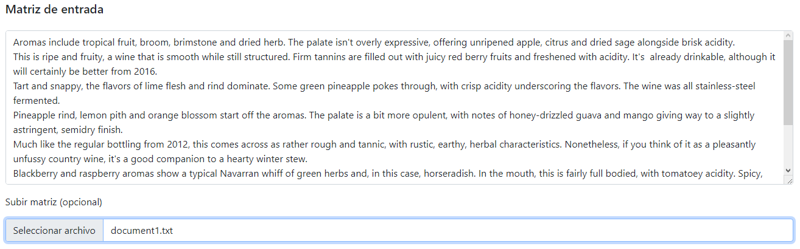
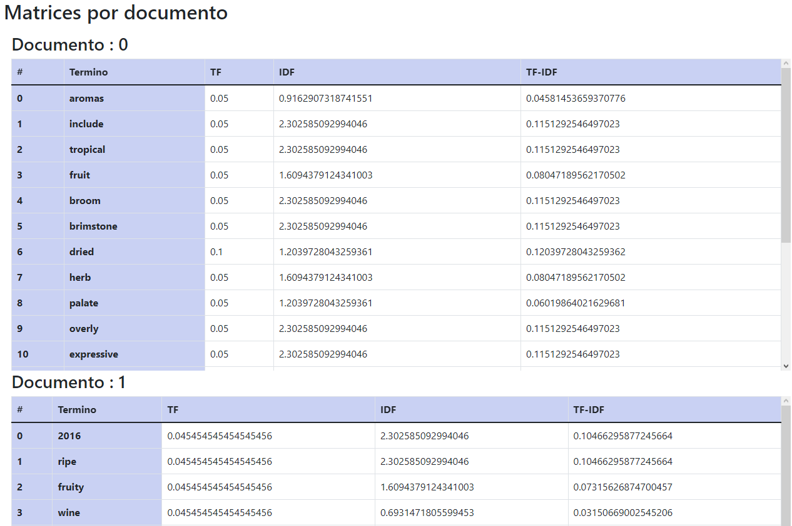
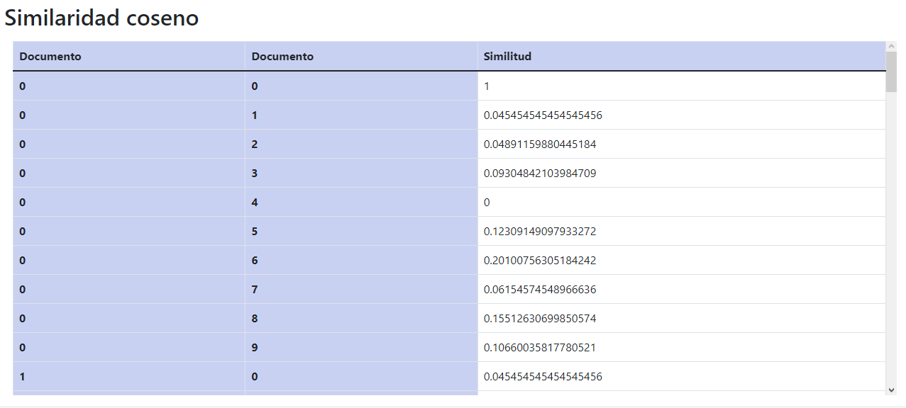

# Sistema de recomendación - Modelos Basados en el Contenido

Para usar la aplicación unicamente debe subir un fichero de texto donde cada linea figure un documento, o bien escribirlo a mano dentro del campo de entrada de la matriz.

Una vez cargado el documento, solo se debe apretar el boton calcular para generar las tablas.

 ## Ejemplo de uso

 Se carga el fichero de texto :

    

 Hacer click en el boton calcular luego de haber cargado el fichero de texto para generar las tablas :
 
  

 Al final de las tablas se encuentra la similaridad entre los documentos con la formula de similitud coseno :
 
  

 ## Pagina de la app

 [Sistemas de recomendación - Modelos Basados en el Contenido]()